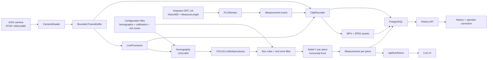
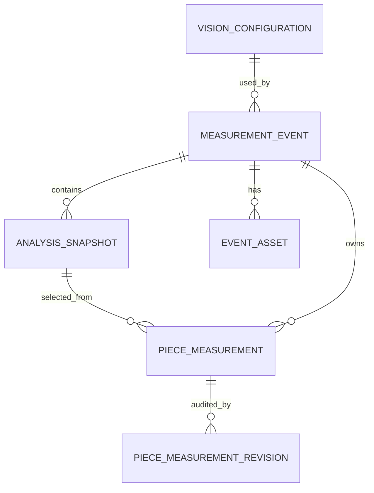

# TX2 Live MVP: guia completa de integracion

Esta es la guia de trabajo para llevar al MVP en tiempo real todo lo que ya
funciona en `homography_web_app.py`:

- homografia y ROI de trabajo;
- calibracion de pulgadas por pixel;
- linea horizontal de referencia;
- zonas rojas donde no deben sobrevivir detecciones;
- deteccion YOLO de piezas individuales;
- reglas geometricas para corregir boxes;
- Sobel Y horizontal por pieza;
- medicion independiente de cada pieza;
- formato compacto como `40' 9 1/16"`;
- grabacion activada por el PLC;
- historial persistente en PostgreSQL;
- correccion de medidas por un operador sin perder la medida automatica.

El documento describe el estado real del repositorio al 27 de julio de 2026,
los cambios que faltan, los contratos de datos recomendados, el modelo de base
de datos y una secuencia de implementacion verificable.

> El objetivo de esta guia no es convertir el tool de calibracion en la
> aplicacion de produccion. El tool se conserva para configurar, anotar,
> entrenar y depurar. El proceso de produccion sigue siendo
> `live_mvp_app.py`.
>
> Excepcion operativa temporal aprobada: mientras TI instala PostgreSQL, el
> Live MVP usa `outputs/tx2_live_mvp.sqlite3`. SQLite refleja las mismas
> entidades y restricciones funcionales, no guarda los MP4 dentro de la base y
> se migra con `tools/migrate_sqlite_to_postgres.py`. Si
> `TX2_POSTGRES_DSN` esta definido y falla, la aplicacion se detiene; nunca cae
> silenciosamente a SQLite.

## 1. Documentos relacionados

- [`README.md`](README.md): entrada general al repositorio y comandos basicos.
- [`docs/postgresql_server_setup.md`](docs/postgresql_server_setup.md):
  instalacion y seguridad de PostgreSQL en el servidor Windows de TX2.
- [`AS20_VISION_SYSTEM_DOCS.md`](AS20_VISION_SYSTEM_DOCS.md): contexto OPC UA
  de `MeasureLength` y `VisionWD`.
- [`bundles/as20_vision_opc_probe/README.md`](bundles/as20_vision_opc_probe/README.md):
  prueba portable de la conexion OPC UA.

## 2. Resultado final esperado

Cuando esta integracion termine, un ciclo de produccion debe verse asi:

1. La camara AXIS entrega frames originales a resolucion nativa.
2. El `CameraReader` conserva un buffer acotado y asigna a cada frame un indice,
   una hora UTC y un tiempo monotonico local.
3. El `LiveProcessor` rectifica el frame con la homografia guardada.
4. YOLO detecta una caja por pieza visible.
5. Las reglas geometricas eliminan duplicados y outliers, y pueden recuperar
   una pieza faltante cuando el patron espacial y Sobel la respaldan.
6. Las zonas rojas eliminan boxes cuyo solapamiento con una zona excede 20%.
7. Sobel Y busca el frente inferior de cada pieza solamente dentro de su ROI.
8. Cada frente se fuerza a una linea horizontal.
9. Cada pieza se mide contra la linea de referencia usando la escala vigente.
10. El frontend muestra la imagen original, el esquema y la tabla de piezas.
11. Una señal rising del PLC crea un evento de medicion y comienza una
    grabacion independiente de 8 segundos.
12. Una nueva señal crea otra ventana fija de 8 segundos. Si ambas ventanas
    coinciden en el tiempo, se conservan como clips separados sin truncarlas.
13. La ventana solo se conserva si YOLO detecta al menos una pieza. Si no
    detecta ninguna, se eliminan el MP4, los snapshots temporales y el evento.
14. El evento, sus piezas, snapshots y rutas de assets se guardan en PostgreSQL.
15. En `History`, el operador puede capturar una medida real para cada pieza.
16. La medida automatica nunca se sobrescribe. Cada cambio del operador queda
    auditado con usuario, hora, valor anterior, valor nuevo y motivo.

## 3. Aplicaciones del repositorio y responsabilidad de cada una

### 3.1 Tool completo de vision

Archivo:

```text
homography_web_app.py
```

URL local:

```text
http://127.0.0.1:5050
```

Responsabilidades:

- seleccionar y guardar homografia;
- extender el ROI rectificado moviendo los lados del rectangulo;
- crear anotaciones individuales para YOLO;
- guardar frames positivos y negativos;
- ejecutar el modelo sobre un frame;
- calibrar `inch_per_px` con uno o varios segmentos;
- colocar la linea horizontal de referencia;
- dibujar y guardar zonas rojas de exclusion;
- reproducir videos offline;
- ejecutar YOLO, Sobel y medicion por pieza;
- guardar capturas de medicion para depuracion.

Este tool puede detenerse, pedir entradas manuales y navegar videos. No debe
estar en el camino critico del procesamiento en vivo.

### 3.2 MVP en tiempo real

Archivo:

```text
live_mvp_app.py
```

URL local:

```text
http://127.0.0.1:8767
```

Historial actual:

```text
http://127.0.0.1:8767/history
```

Responsabilidades actuales:

- leer RTSP de la camara AXIS;
- procesar el frame mas reciente en un thread separado;
- detectar y medir cada pieza de forma independiente;
- aplicar reglas geometricas y zonas rojas configuradas antes de Sobel;
- conservar diagnosticos `box_rules` por snapshot;
- leer `VisionWD` y `MeasureLength` por OPC UA;
- iniciar clips fijos de 8 segundos con señales rising del PLC;
- conservar ventanas cercanas como clips independientes, incluso si se solapan;
- guardar MP4, JSON y snapshots JPEG;
- servir una interfaz ligera en ingles;
- mostrar historia de clips guardados.

Este es el proceso que se debe completar para produccion.

### 3.3 React MVP offline

Directorio:

```text
mvp_react_app/
```

Este frontend consume `/api/mvp/frame` del tool offline. Es una referencia de
diseno e interaccion, pero no es actualmente el frontend servido por
`live_mvp_app.py`.

No se deben mezclar los dos MVP sin una decision explicita:

- opcion A, recomendada para el primer entregable: mejorar el HTML embebido de
  `live_mvp_app.py`;
- opcion B, posterior: compilar React y servirlo desde el backend live, usando
  las APIs `/api/live/*`.

## 4. Estado actual: que ya esta y que falta

Estado actualizado el 2026-07-27 en `codex/live-mvp-integration`: la capa de
aplicacion PostgreSQL, migracion, reconciliacion, History y auditoria ya esta
implementada. La instalacion del servicio PostgreSQL, el login restringido,
`pgpass.conf`, backups y la validacion end-to-end en el servidor siguen siendo
pasos operativos y requieren permisos de administrador. SQLite esta
implementado como backend temporal y migrable para no detener el Live MVP.

| Capacidad | Tool offline | Live MVP | Trabajo pendiente |
|---|---:|---:|---|
| Homografia guardada | Si | Si | Validacion operativa |
| ROI de trabajo extendido | Si | Si, por archivo | Validar dimensiones al iniciar |
| Varias mediciones de calibracion | Si | Si, se cargan | Exponer version activa |
| Linea horizontal de referencia | Si | Si | Mostrarla consistentemente |
| Offset `475 1/16 in` | Si | Si | No hardcodearlo fuera de config |
| Zonas rojas editables | Si | Si, si estan configuradas | Guardar zonas para la calibracion desplegada |
| Tolerancia de zona de 20% | Si | Si, probada | Validacion operativa |
| YOLO individual | Si | Si | Reiniciar con checkpoint individual y validar en camara |
| Reglas geometricas | Si | Si, con `box_rules` | Validacion operativa |
| Sobel por pieza | Si | Si | Mantener exacto el algoritmo |
| Frente siempre horizontal | Si | Si | Agregar prueba live |
| Medida por pieza | Si | Si | Validacion con piezas reales |
| Formato `40' 9 1/16"` | Si | Si | Validacion visual |
| PLC/OPC UA | Pruebas | Si | Endurecer reconexion y metricas |
| Clips fijos de 8 s | No aplica | Si, ventanas independientes | Validacion de duracion/retencion |
| SQLite temporal | No | Implementado | Migrar y retirar despues de validar PostgreSQL |
| PostgreSQL | No | Implementado | Instalar/configurar servicio y ejecutar migraciones |
| Edicion en History | No | Implementada | Validacion operativa y permisos |
| Autenticacion del operador | No | Identidad explicita inicial | Integrar Azure AD |

## 5. Artefactos vigentes

Los siguientes archivos forman una sola configuracion de vision y deben
desplegarse juntos:

```text
outputs/homography_selection.json
outputs/table_measurement_calibration.json
runs/detect/runs_tx2/yolo11n_pieces_v1/weights/best.pt
```

No se debe copiar solo el modelo ni solo la homografia. Las coordenadas de boxes,
zonas, referencia y Sobel viven en la imagen rectificada; por eso dependen de la
misma matriz y del mismo `output_size`.

La calibracion desplegada preservada en esta rama no contiene actualmente
`exclusion_zones`. El pipeline Live ya aplica y dibuja las zonas que reciba,
pero no se deben recuperar coordenadas de una calibracion anterior. Las zonas
deben guardarse nuevamente desde el tool usando la homografia desplegada.

### 5.1 Homografia actual

La configuracion actual produce una imagen rectificada de:

```text
1191 x 404 px
```

El ROI usa:

```json
{
  "roi_mode": "side_margins",
  "roi_margins": {
    "left": 22.270883225786466,
    "right": 22.556454688270833,
    "top": 37.809393681943796,
    "bottom": 124.93205396229467
  }
}
```

Estos valores son contexto, no constantes de codigo. La fuente de verdad sigue
siendo `outputs/homography_selection.json`.

### 5.2 Calibracion actual

La configuracion vigente contiene tres segmentos:

```text
segmento 1: 14.188 in / 236.7107 px
segmento 2: 52.500 in / 868.4859 px
segmento 3: 14.750 in / 237.2839 px
```

Escala combinada:

```text
inch_per_px = 0.06066233139459905
px_per_in   = 16.484694488498228
```

Referencia:

```text
reference_y         = 258.27946406645873 px
reference_offset_in = 475.0625 in
```

El offset `475.0625` equivale a:

```text
39' 7 1/16"
```

### 5.3 Zonas rojas actuales

El archivo de calibracion contiene dos zonas laterales:

```json
[
  {
    "x": 0.0,
    "y": 0.011794656203288489,
    "w": 180.2514071294559,
    "h": 401.5844544095665
  },
  {
    "x": 1047.9906191369605,
    "y": 0.6156810538116593,
    "w": 142.0093808630395,
    "h": 400.37668161434976
  }
]
```

Regla actual:

```text
exclusion_max_box_overlap = 0.20
```

Una caja se conserva si ocupa 20% o menos dentro de la zona roja. Se elimina
si el area de interseccion dividida entre el area total del box es mayor a 20%.

Formula:

```text
overlap_ratio = intersection_area(box, zone) / area(box)
```

El porcentaje se calcula respecto al box, no respecto al area de la zona.

### 5.4 Modelo individual actual

Checkpoint:

```text
runs/detect/runs_tx2/yolo11n_pieces_v1/weights/best.pt
```

Entrenamiento:

```text
modelo base: YOLO11n
imgsz:       960
batch:       8
best epoch:  52
```

Dataset actual:

```text
21 frames anotados
84 boxes individuales
0 frames negativos
```

Metricas de la pequena validacion:

```text
precision:  0.99125
recall:     1.00000
mAP50:      0.99500
mAP50-95:   0.64155
```

Estas metricas no prueban todavia robustez de produccion. El conjunto es muy
pequeno y no contiene negativos. Antes de confiar en la tasa de falsos positivos
se deben guardar y entrenar frames sin piezas medibles. Las zonas rojas ayudan,
pero no sustituyen ejemplos negativos.

### 5.5 Confianza alineada para validacion

El tool y el launcher Live usan inicialmente:

```text
conf = 0.10
```

El parametro es configurable con `-Confidence` en `run_live_mvp_app.ps1`. El
threshold final debe medirse con videos y camara reales y ajustarse usando
precision/recall operacional; `0.10` es el punto comun para comparar tool y Live,
no una aprobacion final de produccion.

## 6. Arquitectura objetivo



### 6.1 Threads actuales que se deben conservar

`live_mvp_app.py` separa:

- thread de lectura de camara;
- thread de procesamiento de vision;
- thread de monitoreo PLC;
- un thread de grabacion por evento activo;
- threads de Flask para peticiones HTTP.

PostgreSQL no debe obligar a compartir una sola conexion entre threads. Se debe
usar un pool de conexiones y una transaccion corta por operacion.

## 7. Pipeline de vision que debe ejecutar el Live MVP

El orden importa. El pipeline objetivo es:

```text
original frame
  -> warpPerspective
  -> YOLO
  -> duplicate/size/gap rules
  -> red-zone filtering
  -> left-to-right ordering
  -> Sobel per piece
  -> horizontal front line
  -> per-piece measurement
  -> original/rectified overlays
  -> API + recorder + PostgreSQL
```

### 7.1 Integracion aplicada en `LiveProcessor._process`

El Live carga primero la calibracion y usa la API completa:

```python
calibration = vision.load_measurement_calibration()
boxes, box_rules = vision.predict_yolo_boxes_with_rules(
    rectified,
    conf=float(self.args.conf),
    imgsz=int(self.args.imgsz),
    exclusion_zones=calibration.get("exclusion_zones"),
    exclusion_max_overlap=calibration.get("exclusion_max_box_overlap", 0.20),
)
```

El resultado live incluye:

```python
{
    "boxes": boxes,
    "box_rules": box_rules,
    "pieces": pieces,
    "measurement_summary": measurement_summary,
    "calibration": calibration,
}
```

Esto permite mostrar:

- detecciones crudas;
- boxes eliminados por duplicidad;
- outliers eliminados por tamano;
- piezas inferidas por hueco;
- boxes eliminados por zona roja;
- conteo final.

### 7.2 Reglas geometricas vigentes

La funcion `apply_piece_box_rules` ya implementa:

1. sanitizacion de coordenadas;
2. supresion de boxes fuertemente superpuestos;
3. conservacion del box con mayor confianza;
4. perfil tipico de ancho y alto;
5. eliminacion de outliers severos;
6. calculo del pitch horizontal tipico;
7. deteccion de huecos internos;
8. inferencia de boxes faltantes solo con soporte a ambos lados;
9. validacion Sobel del box inferido.

No se debe agregar una caja solamente porque existe una distancia grande entre
dos detecciones aisladas. El patron requerido es equivalente a:

```text
P1, P2 -- hueco anormal -- P3, P4
```

### 7.3 Zonas rojas

Las zonas se guardan en coordenadas rectificadas. Deben aplicarse:

- despues de las reglas que pueden generar boxes inferidos;
- antes de `analyze_piece_boxes`;
- antes de ejecutar Sobel;
- antes de contar piezas para el frontend;
- antes de guardar la medicion canonica en PostgreSQL.

Un box eliminado por zona no debe:

- consumir tiempo en Sobel;
- aparecer como pieza invalida;
- crear una fila `piece_measurement`;
- modificar resumenes min/max/promedio.

El diagnostico si debe conservar:

```json
{
  "exclusion_zone_count": 2,
  "removed_exclusion_count": 1,
  "exclusion_max_overlap": 0.2
}
```

### 7.4 Sobel Y por pieza

`sobel_projection_for_piece`:

- limita el analisis al box de la pieza;
- usa la banda inferior aproximada de 70% del box;
- permite solo una pequena extension debajo del box;
- reduce bordes laterales con un inset;
- usa polaridad `falling`, de claro a oscuro;
- proyecta la linea solamente sobre el ancho de la pieza;
- devuelve una linea horizontal;
- conserva puntos, confianza de borde y `crm_px`.

No se debe volver a usar un solo Sobel para todo el paquete.

### 7.5 Medicion

Para cada pieza:

```text
delta_px       = line_y - reference_y
delta_in       = delta_px * inch_per_px
measurement_in = reference_offset_in + delta_in
```

El valor persistido debe ser numerico en pulgadas:

```text
measurement_in = NUMERIC
```

El formato de pies, pulgadas y fraccion es solamente presentacion.

### 7.6 Formato compacto

Ejemplo:

```text
489.0625 in -> 40' 9 1/16"
```

Reglas:

- redondear al dieciseisavo mas cercano;
- simplificar la fraccion;
- manejar carry de `11 16/16"` a un pie adicional;
- mostrar pulgadas enteras aunque sean cero;
- no guardar el string como valor canonico.

Ejemplos:

```text
480.0000 in -> 40' 0"
480.1875 in -> 40' 0 3/16"
489.0625 in -> 40' 9 1/16"
```

El frontend live, el diagrama, la tabla, el historial y los overlays deben usar
el mismo helper para evitar formatos distintos.

## 8. Contrato de resultado por frame

El resultado del procesador debe conservar los numeros sin formatear:

```json
{
  "frame_index": 900,
  "frame_utc": "2026-07-27T20:00:00.123+00:00",
  "processed_utc": "2026-07-27T20:00:00.190+00:00",
  "original_width": 1920,
  "original_height": 1080,
  "rectified_width": 1191,
  "rectified_height": 404,
  "count": 4,
  "box_rules": {
    "raw_count": 5,
    "removed_overlap_count": 0,
    "removed_size_count": 0,
    "inferred_count": 0,
    "removed_exclusion_count": 1,
    "final_count": 4
  },
  "pieces": [
    {
      "piece_id": 1,
      "box": {
        "x": 334.43,
        "y": 306.18,
        "w": 99.06,
        "h": 44.08,
        "conf": 0.91
      },
      "confidence": 0.91,
      "valid": true,
      "sobel": {
        "is_valid": true,
        "line": {
          "x1": 334.43,
          "y1": 294.0,
          "x2": 433.49,
          "y2": 294.0
        },
        "edge_confidence": 0.76,
        "crm_px": 2.54
      },
      "measurement": {
        "line_y": 294.0,
        "reference_y": 258.27946406645873,
        "delta_px": 35.72053593354127,
        "delta_in": 2.167,
        "reference_offset_in": 475.0625,
        "measurement_in": 477.2295,
        "inch_per_px": 0.06066233139459905
      }
    }
  ],
  "measurement_summary": {
    "detected_count": 4,
    "valid_count": 4,
    "invalid_count": 0,
    "minimum_in": 477.1,
    "maximum_in": 477.4,
    "average_in": 477.25
  }
}
```

Las imagenes base64 pueden seguir en `/api/live/frame`, pero no deben guardarse
como base64 en PostgreSQL.

## 9. Configuracion y reproducibilidad

Cada evento debe registrar con que configuracion fue calculado:

- JSON completo de homografia;
- JSON completo de calibracion;
- zonas rojas;
- threshold de zona;
- ruta y SHA-256 del checkpoint;
- `conf`;
- `imgsz`;
- commit Git del backend, si esta disponible;
- resolucion original y rectificada.

Motivo: si el operador revisa un evento antiguo despues de cambiar la
calibracion, la medida historica debe seguir siendo explicable.

La configuracion de un evento nunca debe apuntar solamente al archivo actual,
porque ese archivo puede cambiar.

## 10. PostgreSQL como destino de produccion

PostgreSQL sera la base de datos final de produccion. Durante el bloqueo de
instalacion del servicio Windows se permite una sola base SQLite local:

```text
outputs/tx2_live_mvp.sqlite3
```

No se debe agregar:

- otra base SQLite ni una base por clip;
- una base separada para History;
- valores editables guardados solamente en JSON;
- estado de operador dentro de `localStorage`.

SQLite usa las mismas entidades de eventos, snapshots, piezas, assets y
revisiones. Los MP4 y JPEG permanecen en disco. La base seleccionada guarda sus
rutas, metadatos y hashes.

### 10.1 Dependencia recomendada

Agregar a `requirements.txt`:

```text
psycopg[binary,pool]>=3.2,<4
```

No se necesita introducir un ORM para el primer MVP. El proyecto actual es
pequeno y las operaciones son explicitas; `psycopg` con SQL versionado mantiene
el alcance controlado.

### 10.2 Variable de conexion

Ya esta acordada:

```powershell
$env:TX2_POSTGRES_DSN = "host=127.0.0.1 port=5432 dbname=tx2_vision user=tx2_vision_app connect_timeout=5"
```

La contrasena debe permanecer en:

```text
%APPDATA%\postgresql\pgpass.conf
```

No se debe poner la contrasena en Git, en el launcher ni en el DSN.

## 11. Modelo de datos propuesto

### 11.1 Relaciones



### 11.2 Principios

- Un `measurement_event` representa una señal PLC.
- Un evento puede contener cero o mas piezas.
- Un `analysis_snapshot` representa un frame procesado dentro del clip.
- Un snapshot se marca como canonico para definir las piezas del evento.
- `piece_measurement.automatic_measurement_in` nunca se actualiza por el
  operador.
- `piece_measurement.operator_measurement_in` es opcional.
- El valor efectivo es `COALESCE(operator, automatic)`.
- Cada cambio de operador crea una revision inmutable.
- Las rutas se guardan relativas a `outputs/`, no como paths absolutos de una
  maquina especifica.

## 12. Migracion SQL inicial

Implementada en:

```text
db/migrations/001_initial.sql
```

Contenido recomendado:

```sql
BEGIN;

CREATE TABLE vision_configuration (
    id uuid PRIMARY KEY,
    created_at timestamptz NOT NULL DEFAULT now(),
    homography_sha256 text NOT NULL,
    calibration_sha256 text NOT NULL,
    model_sha256 text NOT NULL,
    homography_json jsonb NOT NULL,
    calibration_json jsonb NOT NULL,
    model_path text NOT NULL,
    model_name text NOT NULL,
    confidence_threshold double precision NOT NULL,
    inference_size integer NOT NULL,
    app_commit_sha text,
    UNIQUE (
        homography_sha256,
        calibration_sha256,
        model_sha256,
        confidence_threshold,
        inference_size
    )
);

CREATE TABLE measurement_event (
    id uuid PRIMARY KEY,
    event_key text NOT NULL UNIQUE,
    configuration_id uuid NOT NULL
        REFERENCES vision_configuration(id),
    status text NOT NULL
        CHECK (status IN (
            'recording',
            'processing',
            'complete',
            'needs_review',
            'failed'
        )),
    plc_endpoint text NOT NULL,
    plc_event_node text NOT NULL,
    plc_watchdog_node text NOT NULL,
    plc_edge text NOT NULL,
    plc_event_value jsonb,
    plc_previous_event_value jsonb,
    plc_watchdog_value jsonb,
    plc_source_timestamp timestamptz,
    plc_server_timestamp timestamptz,
    app_received_at timestamptz NOT NULL,
    recording_started_at timestamptz,
    recording_ended_at timestamptz,
    stop_reason text,
    camera_source text,
    camera_width integer,
    camera_height integer,
    first_frame_index bigint,
    last_frame_index bigint,
    first_frame_utc timestamptz,
    last_frame_utc timestamptz,
    detected_piece_count integer NOT NULL DEFAULT 0,
    valid_piece_count integer NOT NULL DEFAULT 0,
    canonical_snapshot_id bigint,
    error_text text,
    legacy_sidecar_path text UNIQUE,
    created_at timestamptz NOT NULL DEFAULT now(),
    updated_at timestamptz NOT NULL DEFAULT now()
);

CREATE INDEX measurement_event_source_time_idx
    ON measurement_event (plc_source_timestamp DESC);

CREATE INDEX measurement_event_created_idx
    ON measurement_event (created_at DESC);

CREATE INDEX measurement_event_status_idx
    ON measurement_event (status, created_at DESC);

CREATE TABLE analysis_snapshot (
    id bigint GENERATED ALWAYS AS IDENTITY PRIMARY KEY,
    event_id uuid NOT NULL
        REFERENCES measurement_event(id) ON DELETE CASCADE,
    frame_index bigint NOT NULL,
    frame_utc timestamptz,
    processed_utc timestamptz NOT NULL,
    processing_duration_ms double precision,
    is_canonical boolean NOT NULL DEFAULT false,
    detected_piece_count integer NOT NULL DEFAULT 0,
    valid_piece_count integer NOT NULL DEFAULT 0,
    measurement_summary jsonb NOT NULL DEFAULT '{}'::jsonb,
    box_rules jsonb NOT NULL DEFAULT '{}'::jsonb,
    original_overlay_path text,
    rectified_overlay_path text,
    result_json jsonb NOT NULL,
    UNIQUE (event_id, frame_index)
);

CREATE INDEX analysis_snapshot_event_idx
    ON analysis_snapshot (event_id, frame_index);

CREATE UNIQUE INDEX analysis_snapshot_one_canonical_idx
    ON analysis_snapshot (event_id)
    WHERE is_canonical;

CREATE TABLE piece_measurement (
    id uuid PRIMARY KEY,
    event_id uuid NOT NULL
        REFERENCES measurement_event(id) ON DELETE CASCADE,
    snapshot_id bigint NOT NULL
        REFERENCES analysis_snapshot(id) ON DELETE CASCADE,
    piece_number integer NOT NULL CHECK (piece_number > 0),
    is_valid boolean NOT NULL,
    review_required boolean NOT NULL DEFAULT false,
    yolo_confidence double precision,
    sobel_confidence double precision,
    crm_px double precision,
    delta_px double precision,
    distance_to_reference_in numeric(12, 6),
    automatic_measurement_in numeric(12, 6),
    operator_measurement_in numeric(12, 6),
    operator_revision integer NOT NULL DEFAULT 0,
    box_json jsonb NOT NULL,
    sobel_json jsonb NOT NULL,
    automatic_result_json jsonb NOT NULL,
    created_at timestamptz NOT NULL DEFAULT now(),
    updated_at timestamptz NOT NULL DEFAULT now(),
    CHECK (
        automatic_measurement_in IS NULL
        OR automatic_measurement_in BETWEEN 0 AND 2400
    ),
    CHECK (
        operator_measurement_in IS NULL
        OR operator_measurement_in BETWEEN 0 AND 2400
    ),
    UNIQUE (event_id, piece_number)
);

CREATE INDEX piece_measurement_event_idx
    ON piece_measurement (event_id, piece_number);

CREATE TABLE piece_measurement_revision (
    id bigint GENERATED ALWAYS AS IDENTITY PRIMARY KEY,
    piece_measurement_id uuid NOT NULL
        REFERENCES piece_measurement(id) ON DELETE CASCADE,
    revision integer NOT NULL CHECK (revision > 0),
    action text NOT NULL
        CHECK (action IN ('set', 'change', 'clear')),
    previous_operator_measurement_in numeric(12, 6),
    new_operator_measurement_in numeric(12, 6),
    automatic_measurement_in numeric(12, 6),
    operator_id text NOT NULL,
    operator_display_name text,
    reason text NOT NULL,
    source_ip inet,
    changed_at timestamptz NOT NULL DEFAULT now(),
    UNIQUE (piece_measurement_id, revision)
);

CREATE INDEX piece_revision_piece_idx
    ON piece_measurement_revision (
        piece_measurement_id,
        revision DESC
    );

CREATE TABLE event_asset (
    id bigint GENERATED ALWAYS AS IDENTITY PRIMARY KEY,
    event_id uuid NOT NULL
        REFERENCES measurement_event(id) ON DELETE CASCADE,
    asset_type text NOT NULL
        CHECK (asset_type IN (
            'video',
            'sidecar',
            'original_overlay',
            'rectified_overlay'
        )),
    relative_path text NOT NULL,
    mime_type text,
    size_bytes bigint,
    sha256 text,
    created_at timestamptz NOT NULL DEFAULT now(),
    UNIQUE (event_id, asset_type, relative_path)
);

CREATE VIEW piece_measurement_effective AS
SELECT
    pm.*,
    COALESCE(
        pm.operator_measurement_in,
        pm.automatic_measurement_in
    ) AS effective_measurement_in,
    pm.operator_measurement_in IS NOT NULL AS has_operator_override
FROM piece_measurement pm;

ALTER TABLE measurement_event
    ADD CONSTRAINT measurement_event_canonical_snapshot_fk
    FOREIGN KEY (canonical_snapshot_id)
    REFERENCES analysis_snapshot(id);

COMMIT;
```

El limite de `2400 in` es un guardrail tecnico de 200 pies, no una regla de
negocio confirmada. Debe revisarse con operaciones antes de produccion.

## 13. Ciclo de vida de un evento en PostgreSQL

### 13.1 Al recibir la señal PLC

1. Crear `event_id` con `uuid.uuid4()` en la aplicacion.
2. Construir un `event_key` idempotente.
3. Obtener o crear `vision_configuration`.
4. Insertar `measurement_event` con estado `recording`.
5. Pasar `event_id` dentro del `control` de `ClipRecorder`.

Ejemplo de `event_key`:

```text
SHA256(
  plc_endpoint
  + event_node
  + source_timestamp
  + edge
  + serialized_event_value
)
```

Si el PLC no entrega `source_timestamp`, el monitor debe crear una identidad
estable para ese trigger y reutilizarla en reintentos. No se debe generar una
nueva fila por cada reconexion.

### 13.2 Mientras se graba

- continuar escribiendo MP4 a disco;
- capturar snapshots tecnicos;
- no guardar base64 en PostgreSQL;
- insertar o acumular metadata de `analysis_snapshot`;
- conservar `frame_index`, `frame_utc` y `processed_utc`;
- conservar `box_rules` y todos los resultados automaticos.

### 13.3 Al cerrar el clip

1. Cerrar correctamente `VideoWriter`.
2. Verificar si YOLO detecto al menos una pieza en cualquier snapshot de los
   8 segundos.
3. Si no hubo piezas, eliminar MP4, snapshots temporales y evento pendiente;
   no mostrar esa ventana en `History`.
4. Elegir un snapshot canonico.
5. Insertar sus piezas en `piece_measurement`.
6. Insertar rutas en `event_asset`.
7. Actualizar conteos y timestamps del evento.
8. Marcar `complete` si todas las piezas son validas.
9. Marcar `needs_review` si hay piezas invalidas o no hay snapshot confiable.
10. Hacer commit de la transaccion.

Si falla el procesamiento, guardar el evento como `failed` y conservar
`error_text` y los assets recuperables.

## 14. Seleccion del snapshot canonico

El `piece_id` actual se asigna de izquierda a derecha en cada frame. No es un
tracking persistente entre frames. Por eso no se deben insertar todas las
apariciones de `P1` durante 8 segundos como si fueran la misma pieza fisica.

Para el primer MVP se recomienda:

1. agregar `frame_monotonic` al resultado de `LiveProcessor`;
2. considerar snapshots desde la señal hasta 1.5 segundos despues;
3. descartar snapshots sin mediciones validas;
4. elegir por este orden:
   - mayor `valid_count`;
   - menor `invalid_count`;
   - mayor promedio de `edge_confidence`;
   - menor distancia temporal a la señal PLC;
5. si no existe candidato en 1.5 segundos, buscar en todo el clip;
6. guardar todos los snapshots como evidencia;
7. crear `piece_measurement` solamente desde el snapshot canonico.

Esta ventana debe confirmarse en la linea real. Si una señal corresponde a un
flujo de varias piezas distintas durante todo el clip, sera necesario tracking
temporal y el esquema debera usar una identidad de pieza fisica, no solo orden
horizontal.

## 15. Acceso a PostgreSQL desde Flask

Estructura minima sugerida:

```text
db/
  migrations/
    001_initial.sql
tx2_database.py
tools/
  apply_postgres_migrations.py
  migrate_live_sidecars_to_postgres.py
```

`tx2_database.py` debe poseer:

- `ConnectionPool`;
- health check;
- `get_or_create_configuration`;
- `create_measurement_event`;
- `save_event_snapshots`;
- `finalize_measurement_event`;
- `list_measurement_events`;
- `get_measurement_event`;
- `set_operator_measurement`;
- `clear_operator_measurement`;
- `register_assets`.

No se debe pasar una conexion psycopg viva entre threads.

### 15.1 Inicio de aplicacion

En produccion:

- `TX2_POSTGRES_DSN` es obligatorio;
- las migraciones deben estar aplicadas;
- si PostgreSQL no conecta, el health check debe indicar error;
- no se debe caer automaticamente a SQLite.

Para simulacion local puede existir un argumento explicito:

```text
--db-disabled
```

Ese modo no persiste History y debe mostrarse claramente en la UI. Nunca debe
activarse silenciosamente.

## 16. History basado en PostgreSQL

El historial actual enumera archivos JSON con `clip_sidecars`. La version final
debe enumerar eventos de PostgreSQL y resolver sus assets por `event_asset`.

Los sidecars se conservan como evidencia y mecanismo de recuperacion, pero
dejan de ser la fuente principal de la UI.

### 16.1 Lista de eventos

Endpoint:

```http
GET /api/history/events?limit=50&before=2026-07-27T20:00:00Z
```

Respuesta:

```json
{
  "items": [
    {
      "event_id": "f7436b85-3bcb-41a8-8f53-38b7f71b4acf",
      "plc_source_timestamp": "2026-07-27T20:00:00.000Z",
      "status": "complete",
      "stop_reason": "max_duration",
      "detected_piece_count": 4,
      "valid_piece_count": 4,
      "operator_override_count": 1,
      "video_url": "/api/history/events/f7436b85-3bcb-41a8-8f53-38b7f71b4acf/video"
    }
  ],
  "next_cursor": "2026-07-27T19:59:59.999Z"
}
```

### 16.2 Detalle de evento

Endpoint:

```http
GET /api/history/events/<event_id>
```

Debe devolver:

- metadata PLC;
- metadata de camara;
- configuracion utilizada;
- video y snapshots;
- piezas ordenadas;
- medida automatica;
- medida de operador;
- medida efectiva;
- revision actual;
- historial de cambios;
- diagnosticos YOLO/Sobel.

### 16.3 Edicion de medida por pieza

Endpoint recomendado:

```http
PATCH /api/history/events/<event_id>/pieces/<piece_id>/operator-measurement
Content-Type: application/json
```

Payload compacto:

```json
{
  "feet": 40,
  "inches": 9,
  "sixteenths": 1,
  "reason": "Verified manually on the table",
  "operator_id": "ven.luis.puente",
  "operator_display_name": "Luis Puente",
  "expected_revision": 0
}
```

El backend convierte:

```text
measurement_in = feet * 12 + inches + sixteenths / 16
```

Respuesta:

```json
{
  "piece_id": "761605e0-d6f1-4b72-b7d0-eb8979db60cc",
  "automatic_measurement_in": 488.9375,
  "automatic_display": "40' 8 15/16\"",
  "operator_measurement_in": 489.0625,
  "operator_display": "40' 9 1/16\"",
  "effective_measurement_in": 489.0625,
  "effective_display": "40' 9 1/16\"",
  "operator_revision": 1
}
```

### 16.4 Limpiar una correccion

El mismo endpoint puede aceptar:

```json
{
  "clear": true,
  "reason": "Correction entered on the wrong piece",
  "operator_id": "ven.luis.puente",
  "operator_display_name": "Luis Puente",
  "expected_revision": 1
}
```

Esto:

- inserta una revision con accion `clear`;
- pone `operator_measurement_in = NULL`;
- incrementa `operator_revision`;
- vuelve a usar la medida automatica como efectiva.

No se debe borrar el historial de revisiones.

### 16.5 Concurrencia

La actualizacion debe usar revision optimista:

```sql
UPDATE piece_measurement
SET
    operator_measurement_in = %(new_value)s,
    operator_revision = operator_revision + 1,
    updated_at = now()
WHERE id = %(piece_id)s
  AND operator_revision = %(expected_revision)s;
```

Si no actualiza una fila:

```http
409 Conflict
```

El frontend vuelve a cargar la pieza y avisa que otro usuario hizo un cambio.

### 16.6 Transaccion de auditoria

En una sola transaccion:

1. bloquear o actualizar la pieza con `expected_revision`;
2. insertar `piece_measurement_revision`;
3. confirmar ambos cambios;
4. hacer rollback completo si falla cualquiera.

La revision debe conservar:

- medida automatica;
- valor anterior del operador;
- valor nuevo;
- accion;
- identidad;
- motivo;
- IP;
- UTC.

## 17. UI de History

La tabla por pieza debe mostrar como minimo:

| Campo | Ejemplo |
|---|---|
| Piece | P1 |
| Detected | `40' 8 15/16"` |
| Operator | `40' 9 1/16"` |
| Effective | `40' 9 1/16"` |
| Difference | `+1/8"` |
| YOLO confidence | `0.91` |
| Sobel confidence | `0.76` |
| Status | Corrected |

Edicion recomendada:

- input numerico para pies;
- input de pulgadas enteras de 0 a 11;
- selector de fraccion en dieciseisavos;
- campo obligatorio de motivo;
- boton Save;
- boton Clear correction;
- indicador de guardado/error;
- dialogo de confirmacion si la diferencia excede una tolerancia de negocio.

No usar un unico input de texto libre como `40ft9...`. El backend siempre debe
validar los componentes numericos.

### 17.1 Etiquetas

La aplicacion visible debe permanecer en ingles:

```text
Detected
Operator measurement
Effective measurement
Reason
Save correction
Clear correction
Revision history
```

Las medidas se muestran compactas:

```text
40' 9 1/16"
```

## 18. Assets y rutas

Los archivos siguen bajo:

```text
outputs/live_plc_clips/<YYYY-MM-DD>/
```

PostgreSQL debe guardar rutas relativas, por ejemplo:

```text
live_plc_clips/2026-07-27/live_0001_..._rising.mp4
```

El backend resuelve la ruta contra `output_dir` y verifica que permanezca dentro
de ese root antes de servirla. Se debe conservar la validacion equivalente a
`path_is_inside`.

No guardar:

- rutas suministradas directamente por el browser;
- `..`;
- URLs de red sin validacion;
- base64 de imagenes;
- bytes de MP4 en PostgreSQL para este MVP.

## 19. Migracion de clips JSON existentes

Crear:

```text
tools/migrate_live_sidecars_to_postgres.py
```

Flujo:

1. buscar `outputs/live_plc_clips/**/*.json`;
2. validar sidecar;
3. usar `legacy_sidecar_path` como clave unica;
4. crear evento;
5. crear configuracion historica si existe snapshot;
6. insertar `analysis_snapshot`;
7. elegir snapshot canonico;
8. insertar piezas;
9. registrar assets;
10. reportar importados, omitidos y errores.

La herramienta debe soportar:

```powershell
python tools\migrate_live_sidecars_to_postgres.py --dry-run
python tools\migrate_live_sidecars_to_postgres.py
```

Debe ser idempotente. Ejecutarla dos veces no puede duplicar eventos.

## 20. Comportamiento cuando PostgreSQL no esta disponible

El PLC y la grabacion no deberian perder el clip por una interrupcion breve de
la base de datos.

Estrategia:

1. intentar insertar el evento;
2. si falla, seguir guardando MP4, sidecar y snapshots;
3. marcar el sidecar con `db_sync_status = "pending"`;
4. reintentar con backoff;
5. exponer contador de pendientes;
6. reconciliar al reiniciar;
7. no cambiar automaticamente de PostgreSQL a SQLite.

El sidecar de recuperacion permite reconstruir el evento. SQLite es un backend
temporal explicito, no una cola activada por errores de PostgreSQL.

## 21. Cambios concretos por archivo

### `homography_web_app.py`

- [x] Mantener `predict_yolo_boxes_with_rules`.
- [x] Mantener `filter_boxes_by_exclusion_zones`.
- [x] Mantener `analyze_piece_boxes`.
- [x] Permitir el threshold de exclusion configurado por el consumidor.
- [x] Agregar tests al modificar contratos.

### `live_mvp_app.py`

- [x] Cargar calibracion antes de YOLO.
- [x] Pasar `exclusion_zones`.
- [x] Devolver `box_rules`.
- [x] Dibujar zonas rojas en rectified overlay.
- [x] Usar formato compacto.
- [x] Agregar `frame_monotonic` al resultado.
- [x] Crear evento DB al trigger PLC.
- [x] Pasar `event_id` al recorder.
- [x] Guardar snapshots y piezas.
- [x] Convertir History a consultas de la base seleccionada.
- [x] Exponer health de DB.
- [x] No romper cierre por siguiente señal.

### `run_live_mvp_app.ps1`

- [x] Validar `TX2_POSTGRES_DSN` desde el backend al iniciar.
- [x] Mostrar modelo seleccionado y SHA-256.
- [x] Mostrar rutas de configuracion.
- [x] Hacer configurable `conf`.
- [x] Hacer visible/configurable la IP de camara.
- [x] Conservar credenciales AXIS fuera del repo.

### `requirements.txt`

- [x] Agregar `psycopg[binary,pool]`.
- [ ] Fijar rangos de todas las versiones antes de despliegue.

### `tests/`

Implementados:

```text
test_live_vision_pipeline.py
test_exclusion_zones_live.py
test_measurement_format.py
test_postgres_integration.py
test_history_api.py
test_sqlite_database.py
```

### Nuevos archivos

```text
tx2_database.py
db/migrations/001_initial.sql
tools/apply_postgres_migrations.py
tools/migrate_live_sidecars_to_postgres.py
```

## 22. Fases de implementacion

### Fase 0: congelar una referencia

- [ ] Guardar copia aprobada de homografia.
- [ ] Guardar copia aprobada de calibracion y zonas.
- [ ] Calcular SHA-256 del modelo.
- [ ] Registrar commit Git.
- [ ] Elegir un video corto de aceptacion.
- [ ] Documentar boxes y medidas esperadas en frames clave.

### Fase 1: paridad de vision

- [x] Cambiar `LiveProcessor` a `predict_yolo_boxes_with_rules`.
- [x] Pasar zonas rojas.
- [x] Incluir `box_rules`.
- [x] Dibujar zonas rojas.
- [x] Cambiar medidas a formato compacto.
- [x] Alinear `conf` entre tool y live en `0.10` para la comparacion inicial.
- [ ] Comparar frame por frame.
- [x] Confirmar por prueba que Sobel recibe solamente boxes filtrados.

### Fase 2: PostgreSQL base

- [x] Agregar dependencia psycopg al entorno de aplicacion.
- [x] Crear pool.
- [x] Crear migracion `001_initial.sql`.
- [x] Crear comando de migraciones.
- [x] Agregar health check.
- [x] Crear/leer `vision_configuration`.
- [ ] Probar transacciones.

La ultima prueba queda bloqueada hasta que TI permita instalar y configurar el
servicio PostgreSQL. Mientras tanto no se cambia el backend temporal SQLite.

### Fase 3: persistencia de evento

- [x] Crear evento al trigger PLC.
- [x] Pasar UUID al recorder.
- [x] Guardar timestamps PLC/camara.
- [x] Guardar snapshots.
- [x] Seleccionar snapshot canonico.
- [x] Insertar piezas automaticas.
- [x] Registrar assets.
- [x] Finalizar estado.
- [x] Probar dos señales cercanas.

### Fase 4: History desde DB

- [x] Endpoint de lista paginada.
- [x] Endpoint de detalle.
- [x] Resolver video y snapshots.
- [x] Cambiar UI de History.
- [x] Mostrar automatic/effective.
- [x] Mantener acceso a sidecar tecnico.

### Fase 5: correccion del operador

- [x] Formulario pies/pulgadas/dieciseisavos.
- [x] PATCH con revision esperada.
- [x] Auditoria inmutable.
- [x] Clear correction.
- [x] Manejo de 409.
- [x] Identidad explicita inicial del operador.
- [x] Diferencia visible.

La identidad actual es capturada por formulario; autenticacion corporativa
continua pendiente.

### Fase 6: migracion y operacion

- [x] Importar sidecars previos.
- [ ] Configurar backup.
- [ ] Probar restore.
- [x] Definir retencion de 100 clips y sus eventos.
- [ ] Definir servicio Windows.
- [ ] Ejecutar prueba de 8 horas.

## 23. Pruebas obligatorias

### 23.1 Unitarias de vision

- un box con 10% dentro de zona se conserva;
- un box con 30% dentro de zona se elimina;
- una caja completamente dentro se elimina;
- una caja inferida dentro de zona se elimina;
- boxes fuera de zona no cambian;
- la linea Sobel es horizontal;
- cada pieza tiene su propia linea;
- medicion usa su propio `line_y`;
- `40' 9 1/16"` se redondea correctamente;
- carry de pulgadas a pies funciona.

### 23.2 Integracion live

- frame original conserva 1920x1080;
- rectificado conserva 1191x404 con configuracion actual;
- modelo usado es el individual;
- `box_rules` llega a `/api/live/frame`;
- zonas se ven y filtran;
- overlay original mapea frentes correctamente;
- no se usa un frente global para todas las piezas.

### 23.3 PLC y clips

- `VisionWD` cambia aproximadamente cada 69-70 ms;
- se lee `MeasureLength` al cambiar watchdog;
- rising edge crea un evento;
- un segundo rising edge crea otra ventana sin cerrar la anterior;
- cada ventana contiene solo frames desde su señal hasta su limite de 8 segundos;
- cada MP4 reporta 80 frames a 10 FPS y 8 segundos;
- una ventana sin ninguna pieza detectada se descarta y no aparece en History;
- dos ventanas cercanas se conservan como clips independientes;
- sidecar conserva source/server/app timestamps.

### 23.4 PostgreSQL

- mismo `event_key` no duplica fila;
- un evento puede tener cero piezas;
- un evento puede tener muchas piezas;
- automatic measurement no cambia al editar;
- operator measurement cambia effective measurement;
- revision se incrementa;
- revision incorrecta responde 409;
- clear conserva auditoria;
- borrado de evento elimina hijos segun politica;
- rutas fuera de root no se sirven.

### 23.5 Recuperacion

- DB desconectada no corrompe MP4;
- sidecar queda pendiente;
- reconexion sincroniza una sola vez;
- reinicio durante clip deja error recuperable;
- migracion repetida no duplica.

### 23.6 Rendimiento

Para 10 FPS:

```text
presupuesto promedio por frame <= 100 ms
```

Para 15 FPS:

```text
presupuesto promedio por frame <= 66.7 ms
```

Para 30 FPS:

```text
presupuesto promedio por frame <= 33.3 ms
```

Medir por separado:

- captura;
- warp;
- YOLO;
- reglas;
- Sobel total;
- overlays;
- JPEG;
- DB.

No bajar la resolucion original guardada para compensar inferencia. Si hace
falta, procesar una frecuencia menor que la captura o usar optimizacion
TensorRT, manteniendo el frame original para evidencia.

## 24. Health y observabilidad

Extender `/api/live/status`:

```json
{
  "camera": {
    "connected": true,
    "last_frame_utc": "..."
  },
  "processor": {
    "ok": true,
    "last_duration_ms": 72.4,
    "processed_count": 12345
  },
  "plc": {
    "connected": true,
    "watchdog_ticks": 5000,
    "events_found": 42
  },
  "database": {
    "connected": true,
    "pool_available": 4,
    "pending_sync_count": 0,
    "last_write_utc": "..."
  },
  "configuration": {
    "model": "yolo11n_pieces_v1",
    "homography_sha256": "...",
    "calibration_sha256": "...",
    "red_zone_count": 2,
    "confidence_threshold": 0.1
  }
}
```

Alertas minimas:

- camara desconectada;
- frame viejo;
- PLC desconectado;
- watchdog detenido;
- DB desconectada;
- backlog pendiente;
- procesamiento mas lento que target FPS;
- cero detecciones durante ventana anormal;
- demasiadas detecciones eliminadas por zona;
- clip fallido.

## 25. Seguridad

- PostgreSQL escucha solo en localhost.
- El usuario de aplicacion no es superuser.
- Credenciales en `pgpass.conf`.
- AXIS credentials en variables de entorno.
- No mostrar passwords en `/api/live/status`.
- No devolver DSN completo.
- Validar UUIDs y paths.
- Parametrizar todo SQL.
- No interpolar inputs del operador en SQL.
- Limitar tamano de `reason`.
- Registrar identidad e IP.
- Aplicar autenticacion antes de considerar History una herramienta de
  produccion multiusuario.

## 26. Timestamps

Guardar siempre:

- `plc_source_timestamp`;
- `plc_server_timestamp`;
- `app_received_at`;
- `event_read_monotonic` solo para calculos runtime;
- `frame_utc`;
- `frame_monotonic` solo runtime;
- `processed_utc`;
- inicio y fin de grabacion.

PostgreSQL usa `timestamptz` y UTC.

El tiempo monotonico no debe persistirse como una hora absoluta entre reinicios,
pero si debe usarse para:

- separar clips;
- delimitar cada ventana independiente de 8 segundos;
- seleccionar frames cercanos a la señal;
- medir latencias.

## 27. Despliegue en el servidor

Preparacion:

```powershell
git pull
python -m pip install -r requirements.txt
python -m unittest discover -s tests -v
```

Validar archivos:

```powershell
Test-Path outputs\homography_selection.json
Test-Path outputs\table_measurement_calibration.json
Test-Path runs\detect\runs_tx2\yolo11n_pieces_v1\weights\best.pt
```

Validar PostgreSQL:

```powershell
Test-NetConnection 127.0.0.1 -Port 5432
```

Configurar:

```powershell
$env:TX2_POSTGRES_DSN = "host=127.0.0.1 port=5432 dbname=tx2_vision user=tx2_vision_app connect_timeout=5"
$env:AXIS_USER = "..."
$env:AXIS_PASSWORD = "..."
```

Ejecutar primero con video:

```powershell
python live_mvp_app.py `
  --source video `
  --video "C:\Users\luis_\Downloads\20260724_10\20260724_100105_6439.mkv" `
  --conf 0.10 `
  --port 8767
```

Ejecutar live:

```powershell
.\run_live_mvp_app.ps1
```

Antes de produccion confirmar la IP real de camara. El codigo/launcher actual
usa `10.14.115.241`, mientras documentacion previa tambien menciona
`10.14.115.74` y `10.14.115.75`. No se debe adivinar el endpoint final.

## 28. Rollback

Cada fase debe poder revertirse:

- mantener sidecars y MP4 durante la migracion;
- no eliminar la pagina History antigua hasta validar DB;
- mantener feature flag para History DB durante pruebas;
- no modificar mediciones automaticas al agregar operator overrides;
- hacer backup antes de migrar clips;
- ejecutar migraciones SQL hacia adelante con scripts versionados;
- conservar configuracion anterior por hash.

Si la integracion de DB falla:

1. detener el servicio;
2. conservar `outputs/live_plc_clips`;
3. conservar y respaldar `outputs/tx2_live_mvp.sqlite3`;
4. corregir o restaurar la base seleccionada;
5. ejecutar reconciliacion;
6. verificar conteos;
7. reanudar.

## 29. Cosas que no se deben hacer

- No volver a detectar un paquete completo como una sola caja.
- No aplicar Sobel fuera del box de la pieza.
- No aceptar pendiente en el frente.
- No dibujar la proyeccion solo dentro del ROI cuando se requiere overlay
  original; calcular dentro, proyectar donde corresponda.
- No ejecutar Sobel para boxes eliminados por zona.
- No hardcodear las dos zonas actuales.
- No guardar `40' 9 1/16"` como unico valor.
- No sobrescribir `automatic_measurement_in`.
- No guardar solamente el ultimo cambio del operador.
- No dejar SQLite como backend permanente despues de validar PostgreSQL.
- No guardar imagenes base64 en PostgreSQL.
- No considerar `piece_id` estable entre frames sin tracking.
- No usar `time.time()` para limites de grabacion.
- No bajar la resolucion del MP4 original por rendimiento de YOLO.
- No exponer PostgreSQL a la red de planta.
- No mezclar labels legacy de paquete con labels individuales.

## 30. Definition of Done

La integracion esta terminada cuando:

- [ ] Live y tool producen los mismos boxes en frames de referencia.
- [ ] Live aplica las dos zonas rojas guardadas.
- [x] Un solapamiento menor o igual a 20% se permite.
- [x] Un solapamiento mayor a 20% se elimina.
- [x] Cada pieza conserva box, Sobel, medicion y validez.
- [x] Todos los frentes calculados son horizontales.
- [x] La UI muestra `40' 9 1/16"` sin `ft` ni `in`.
- [ ] La señal PLC crea exactamente un evento en la base seleccionada.
- [x] Dos señales cercanas conservan dos clips independientes de 8 segundos.
- [x] El evento tiene un snapshot canonico explicable.
- [x] History lista eventos desde la base seleccionada.
- [x] El operador puede corregir una pieza.
- [x] La medida automatica sigue intacta.
- [x] El historial de revisiones es visible.
- [x] Conflictos concurrentes regresan 409.
- [x] Los clips anteriores se migran idempotentemente.
- [ ] SQLite temporal se migra a PostgreSQL con conteos y revisiones iguales.
- [ ] DB down deja eventos reconciliables.
- [ ] Backups y restore estan probados.
- [ ] La aplicacion pasa una prueba prolongada sin crecimiento continuo de RAM.
- [ ] El modelo y `conf` fueron validados con camara real.
- [ ] Se agregaron frames negativos al siguiente entrenamiento.

## 31. Orden recomendado para la siguiente sesion

1. Reiniciar el Live MVP con las credenciales AXIS para cargar el checkpoint
   individual, `conf=0.10` y el codigo actualizado.
2. Abrir la calibracion desplegada en el tool y guardar las zonas rojas
   vigentes; el archivo actual no contiene `exclusion_zones`.
3. Ejecutar video simulado a `conf=0.10`.
4. Comparar tool y live en los mismos frames.
5. Validar detecciones, zonas, Sobel y medidas con piezas reales.
6. Ejecutar una prueba prolongada y definir servicio/backup.
7. Cuando TI desbloquee PostgreSQL, instalar el servicio, aplicar migraciones y
   ejecutar la migracion idempotente desde SQLite.

## 32. Resumen de handoff

El codigo de vision necesario ya existe. El mayor riesgo no es volver a
inventar YOLO o Sobel, sino conectar una ruta incompleta en el MVP live,
seleccionar incorrectamente la medicion representativa de un evento o permitir
que una correccion del operador destruya el resultado automatico.

La integracion debe mantener tres capas separadas:

```text
automatic result  -> inmutable y reproducible
operator result   -> editable y auditado
effective result  -> operator si existe; automatic si no
```

El tool configura y valida. El Live MVP procesa y graba. PostgreSQL conserva la
historia operacional. `History` permite revisar y corregir sin perder evidencia.
